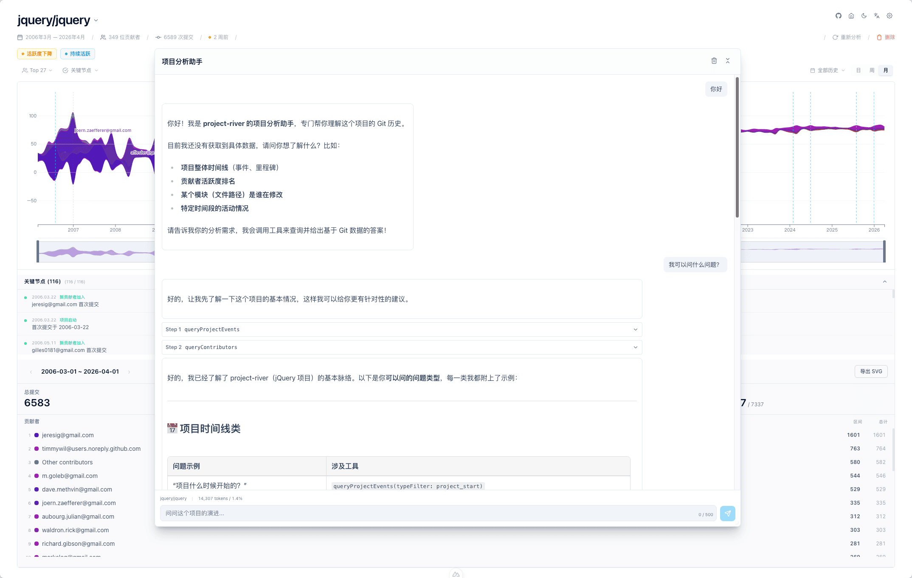

# Changelog

All notable changes to this project will be documented in this file.

The format is based on [Keep a Changelog](https://keepachangelog.com/en/1.1.0/),
and this project adheres to [Semantic Versioning](https://semver.org/spec/v2.0.0.html).

## [Unreleased]

## [0.2.0] - 2026-05-08

### Added

- **AI Agent 分析助手** — 基于 ReAct 循环的智能体引擎，支持工具调用（查询项目事件、贡献者、提交统计），通过 SSE 流式返回分析结果
- **Agent Chat UI** — 可拖拽/可缩放的浮动面板，支持 Markdown 渲染、工具调用卡片、交错式流输出，适配 GitHub Pages 静态模式
- **markstream-vue 流式渲染** — 逐 token 打字机动画，零布局抖动
- **聊天日志本地记录** — server 端按日期归档到 `logs/local/YYYY-MM-DD/*.jsonl`
- **Agent Chat E2E 测试** — Playwright 覆盖完整对话链路
- **nuxt-llms 集成** — 自动生成 `/llms.txt` 供 AI 智能体消费项目上下文
- **i18n 扩展** — Agent 相关文案 12 key，覆盖中英双语
- **SVG 导出优化** — 修复导出尺寸与深色背景适配

### Changed

- `.env.example` 从根目录迁移至 `apps/web/`，新增 `NUXT_AGENT_LLM_API_KEY` / `NUXT_AGENT_LLM_BASE_URL` 配置项
- 流式超时从 60s 延长至 5min
- 工具参数日期格式统一校验，SQL 查询优化（starts_with + ROW_NUMBER 窗口函数）
- 系统提示词增加英文约束段，支持中英双语输出

### Fixed

- markstream-vue 流式渲染卡顿
- SSE route client disconnect 保护与重复事件守卫
- Agent SSE 路由 Anthropic SDK auth 冲突
- queryContributors SQL 错误（ANY → IN）与 email/name 映射修复
- 发送消息后输入框未清空、字符计数器显示顺序
- totalTokensConsumed 持久化到 LocalStorage

## [0.1.0] - 2026-04-24

### Added

- **Streamgraph 河流图可视化** — D3 驱动的交互式贡献者活动流图，支持缩放、刷选、hover 高亮
- **GitHub 仓库导入** — 通过 GitHub URL 克隆并分析完整 Git 历史
- **本地 Git 仓库导入** — 支持本地路径直接导入分析
- **静态模式** — 无需 PostgreSQL 服务端，浏览器端加载预打包的 demo.bin 数据
- **列式压缩数据格式** — 静态数据包体积优化 -36%
- **i18n 全站国际化** — 中英双语支持，完整翻译覆盖
- **主题系统** — 深色/亮色模式切换 + 多套可切换配色方案
- **项目事件检测** — 自动识别 Release、归档、活跃度变化等关键事件
- **Top-N 贡献者选择器** — 动态调整显示的贡献者数量（支持自定义数值）
- **数据聚合粒度控制** — Day / Week / Month 三档粒度切换
- **SVG 导出** — 导出高质量矢量图，含图例与健康摘要
- **健康摘要** — 基于规则引擎的项目健康度分析（活跃度、贡献集中度等）
- **月环比指标** — 月度贡献趋势对比
- **GitRiverCanvas 背景动画** — 首页全屏河流背景 + 滚动模糊效果
- **View Transition 动效** — 主题/语言切换时的平滑过渡动画
- **GitHub Pages 自动部署** — CI/CD 工作流，STATIC_MODE 构建 + deploy-pages

### Changed

- 许可证从 MIT 更改为 BSL 1.1
- 视觉风格统一为玻璃拟态（Glassmorphism）+ Nuxt UI v4 语义令牌
- 导航精简为单一页面架构，首页与项目详情整合
- 面板布局调整为 chart:panel 1:2 比例，内部双栏 1:1

### Fixed

- Streamgraph 缩放/刷选边界问题与交互稳定性
- 面板拖拽布局卡死与高度初始化防重入
- Tooltip 定位溢出与边界处理
- SVG 导出尺寸、深色背景与图例适配
- 贡献者精确计数（后端 contributorCount + 静态 bundle 统一）
- 事件标记日期对齐当前粒度
- Streamgraph x 轴层级渲染顺序

### Removed

- 废弃的独立导航代码与 Stats grid 展示
